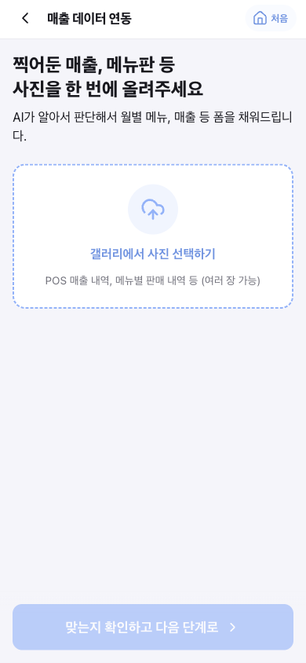
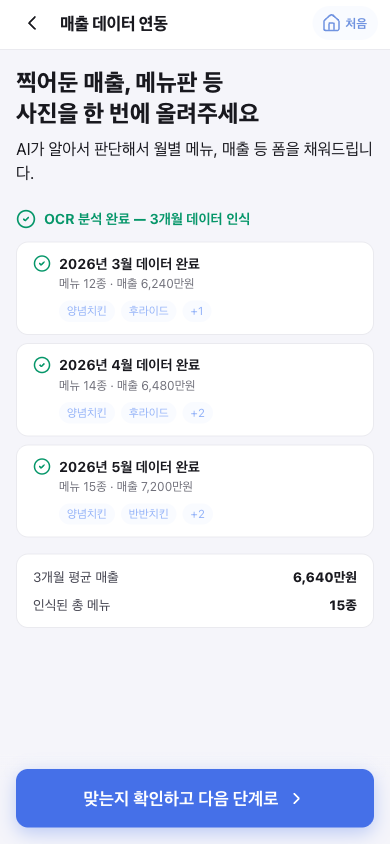
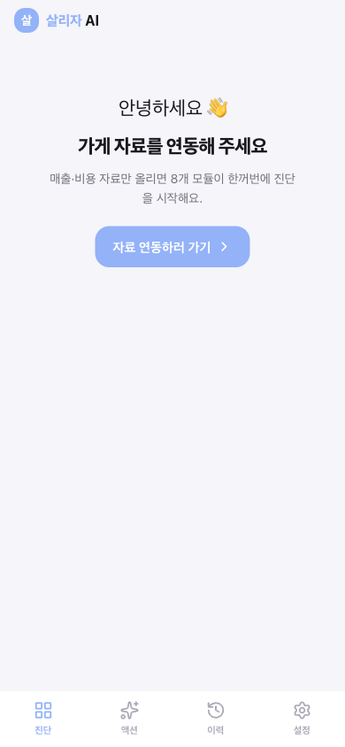
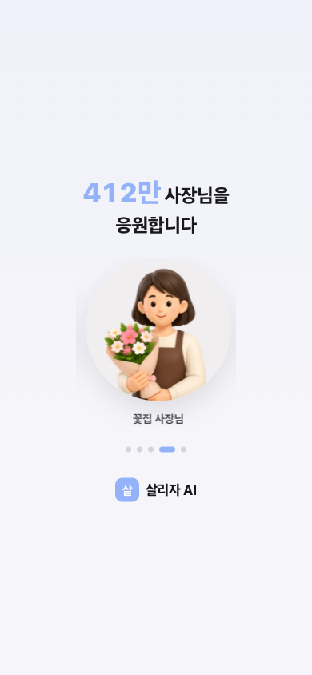
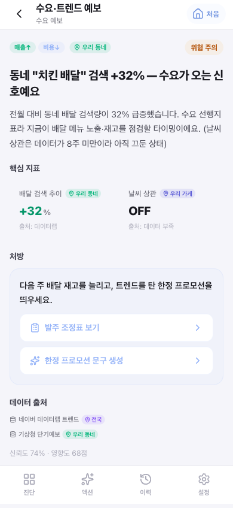

# 살리자 AI — 발표 덱 (v1)

> 🔗 **라이브 데모: https://salija.vercel.app** (모바일/카카오 인앱 브라우저 최적화 · 탭하면 다음)
> 카카오 X SSAFY 해커톤 발표 원고 · 팀 공유/편집용
> 기반 문서: `살리자_통합설계서_v4.md`
> 작성일: 2026-05-31
>
> **편집 규칙**: 슬라이드 = `## S00. 제목` 단위. 본문 불릿은 `-`, 발표 멘트는 `> 🎤` 로 표기.
> 이 md를 고치고 `python3 build_deck.py` 실행하면 `살리자_발표덱.pptx`가 갱신됩니다.

---

## S01. 타이틀

**살리자 AI**
소상공인을 *살리는* AI 파트너

> 데이터 인풋 → 분석 → 액션, **카카오에서 끝까지**

- 팀명: (팀명 입력)
- 카카오 X SSAFY 해커톤 · 2026
- 🔗 라이브 데모: salija.vercel.app
- 🎤 "폐업을 고민하는 사장님 곁에, 어려운 데이터 대신 한 번의 대화를 둡니다."

---

## S02. 문제 — 폐업은 개인의 실패가 아니라 사회문제

- 자영업 폐업은 매년 **80만 건 이상** (국세청 기준), 5년 생존율 **약 33%**
- 소상공인 **412만**, 종사자까지 약 **700만** — 한국 경제의 모세혈관
- 한 가게의 폐업 = 가계 부채 + 상권 공실 + 지역 고용 동시 붕괴
- 🎤 "문제는 '망하는 가게가 많다'가 아니라, **망하기 전에 아무도 못 잡아준다**는 것."

---

## S03. 진짜 문제 — 도와줄 서비스는 이미 많다. 근데 왜 안 쓰일까?

- 정책자금(기업마당), 상권분석(소상공인시장진흥공단), 컨설팅, 매출 분석 툴 — **이미 다 존재**
- 그런데 정작 위기의 사장님은 **그 존재조차 모르거나, 쓸 시간·여력이 없음**
- 좋은 데이터·제도가 "쓰이지 않아서" 죽는다 → **활용의 실패**
- 🎤 "우리가 잡은 핵심 문제는 새 데이터를 만드는 게 아니라, **있는 걸 사장님에게 닿게 하는 것.**"

---

## S04. 원인 진단 — 단절의 3가지

- **① 접근성 단절**: 사장님은 데이터를 '찾으러' 가지 않는다. 별도 웹/앱 설치·로그인부터 이탈
- **② 복잡성 단절**: 상권분석 리포트는 전문가용. 숫자는 많은데 "그래서 뭘 해야 하나"가 없음
- **③ 액션 단절**: 진단에서 끝남. 정책자금 신청·홍보글 작성까지 **직접 연결되지 않음**
- 🎤 "이 세 단절을 메우는 게 살리자의 존재 이유."

---

## S05. 인사이트 — 사장님이 있는 곳으로 간다

- 소상공인은 하루 종일 **카카오톡** 안에 있다 (주문·예약·정산·소통)
- → 서비스를 새로 찾게 하지 말고, **카카오 채널/상담봇 안으로 분석을 가져간다**
- 화려한 대시보드(디자인) 경쟁이 아니라 → **대화 한 번으로 끝나는 경험 + 정확한 예측 모델**
- 🎤 "접근성을 0으로 만들면, 안 쓰이던 데이터가 비로소 일을 시작한다."

---

## S06. 솔루션 — 살리자 AI

**"사진 한 장, 대화 한 번이면 — 진단부터 실행까지."**

핵심 루프 (우리 팀의 목표이자 장점):

```
[데이터 인풋]            [분석]                 [액션]
사진/대화/연동   →   8대 진단 · 예측 모델   →   정책자금·홍보·플랜까지 1번에
(카카오 채널)        (카카오 MCP 기반)         (채널 안에서 바로 실행)
```

- 별도 앱 설치 없이 **카카오 채널 상담봇**으로 진입
- 매출·메뉴 사진을 OCR로 자동 입력, 부족분만 대화로 보완
- 🎤 "인풋에서 액션까지를 **하나의 끊김 없는 루프**로 잇는 게 우리의 차별점."

---

## S07. 차별점 — 왜 살리자인가

- **① 접근성 (카카오 상담봇)**: 설치·학습 없이 평소 쓰던 톡 안에서 진단
- **② 정직한 분석**: 데이터마다 작동 범위(스코프)·신뢰도를 분리 표기 — 과장하지 않음
- **③ 액션까지 1탭**: 진단 카드의 처방이 정책자금 매칭·홍보 콘텐츠·실행 플랜으로 즉시 연결
- 🎤 "남들이 '분석 리포트'에서 멈출 때, 우리는 '신청서 초안'까지 간다."

---

## S08. 사용자 플로우 — 카카오 채널 시나리오

1. 카카오 채널 진입 → "우리 가게 좀 봐줘" (설치·로그인 없음)
2. 매출/메뉴 **사진 업로드** → OCR이 월별 매출·메뉴 자동 인식, 부족분만 대화로 보완
3. AI가 **8대 모듈 진단** → "지금 가장 중요한 것" 1장으로 요약
4. 처방 액션 탭 → 정책자금 D-day, 홍보글 초안, 비용 절감 플랜
5. (선택) 캘린더·알림 연동으로 마감·실행 리마인드




- 🎤 "사장님은 사진만 올렸을 뿐인데, 손에 '오늘 할 일'이 쥐어진다."
- 🎤 "입력이 끝나면 버튼이 선명해진다 — '이제 됐어요' 신호를 색으로 준다."

---

## S09. 8대 진단 모듈 × 3축

3축 택소노미: **A. 매출↑ / B. 비용↓ / C. 위험↓**

- **F1 경쟁 레이더** (A·B) — 반경 내 동종 점포 밀도·포화도
- **F2 수요·트렌드 예보** (A·B) — 검색·시즌·날씨 기반 수요 신호
- **F3 유동–영업시간 적합도** (A) — 동네 시간대 인구 vs 내 매출 분포
- **F4 지역 소비 추세** (C) — 상권 효과 vs 내 가게 효과 분리
- **F5 정책자금 매칭** (C) — 마감 임박 지원사업 + 신청서 초안
- **F6 평판 추세 경보** (C) — 별점·언급량 하락 조기 경보
- **F7 마케팅 콘텐츠 생성** (A) — 처방을 홍보글로 즉시 변환
- **F8 손익분기·현금흐름** (B·C) — BEP·운전자금 소진 시점 예측



- 🎤 "진단이 축을 켜고, 오케스트레이터가 우선순위를 매겨 **카드 1장**으로 보여준다."

---

## S10. 기술 아키텍처 — 카카오 MCP 기반 분석

```
사장님 (카카오 채널)
   │  사진·대화·연동 데이터
   ▼
카카오 i / MCP  ──▶  분석 오케스트레이터
   │                   ├ 룰·Z-score (밀도·포화)
   │                   ├ 예측 모델 (BEP·현금흐름·수요)
   │                   └ LLM(grounded) 처방·초안 생성
   ▼
공공·민간 데이터 소스 (네이버·소진공·기업마당·기상청·부동산원)
   ▼
액션 (정책자금 신청 · 홍보 콘텐츠 · 실행 플랜 · 캘린더)
```

- 분석/도구 호출은 **카카오 MCP**로 오케스트레이션
- 우선순위 점수 = 임팩트 60% + 위험 40% → 종합 위험 스코어
- 🎤 "디자인이 아니라 **모델과 연결**에 무게를 둔 구조."

---

## S11. 예측 모델 — 디자인이 아니라 '정확도'로 승부

- **F8 손익분기/현금흐름**: 매출·임대료·인건비·재료비 4값 → BEP 달성률·운전자금 소진 개월 예측
- **F2 수요 예보**: 검색량 추세 + 시즌성(Prophet) + 날씨 상관 ON/OFF로 발주·프로모션 타이밍
- **F1/F4 포화·추세**: Z-score로 '내 가게 효과'와 '상권 전체 효과' 분리 (착시 제거)
- 모델의 한계도 **숨기지 않고 표기** → 신뢰 가능한 의사결정 보조
- 🎤 "예측을 섬세하게, 그리고 정직하게. 과신을 부추기지 않는 게 진짜 실력."

---

## S12. 데이터 정직성 & 합법성

- 데이터마다 작동 범위가 다름 → **스코프 분리 표기** (가게 / 동네 / 시군구 / 전국)
- 신뢰도 상태 4종: `ready` · `quarterly_lag`(분기 시차) · `seoul_only`(서울 한정) · `manual`(수동)
- **하지 않는 것도 명확히**: 별점 크롤링(약관 위반)·배달앱 데이터(비공개)·카드 개인매출(여신법) → 우회 설계
- 🎤 "'전국 실시간'인 척하지 않는다. 이 정직함이 곧 차별화다."

---

## S13. 확장 — 제휴로 더 풍부하게

- **삼성/캘린더 연동**: 정책자금 마감·발주일·프로모션 일정 자동 등록 + 리마인드
- **카카오 채널 메시지**: D-day 알림, 주간 진단 리포트 푸시
- **공공 API 확장**: 기업마당·소진공·서울 상권·기상청 실데이터 단계적 연결
- 🎤 "접근성(카카오)을 축으로, 실행 채널(캘린더·알림)을 붙여 '관리'까지 확장."

---

## S14. 데모 — 골든패스

**황금올리브 치킨 · 영등포구 · 2026-05**

> 🔗 지금 바로: **salija.vercel.app** (휴대폰으로 열면 실제 화면 그대로)

1. 스플래시("412만 사장님을 응원합니다") → 카카오로 시작
2. 매출 사진 업로드 → 3·4·5월 데이터 자동 인식
3. 대시보드: 위험 **43 (주의)** · 3축 바 · "지금 가장 중요한 것"
4. **[F8 심각] 본전의 82%** → 비용 절감 플랜 / 정책자금 찾기 1탭
5. **[F5] D-9 마감** → 정책자금 매칭 + 신청서 초안





- 🎤 "지금 작동하는 프로토타입으로 인풋→분석→액션 루프 전체를 시연합니다."
- 🎤 "QR이나 salija.vercel.app — 심사위원님 폰에서 직접 만져보실 수 있습니다."

---

## S15. 시장 · 임팩트

- 대상: 소상공인 **412만** 사업체 (종사자 약 700만)
- 진입점: 카카오 채널 — 신규 설치 마찰 **0**
- 임팩트: 폐업 **선제 경보** + 정책자금 **활용률** 제고 + 액션 실행률 상승
- 🎤 "한 명의 사장님을 4개월 먼저 잡으면, 한 가정과 상권을 지킨다."

---

## S16. 서비스 루프 / 지속 가능성

- **무료 진단 → 신뢰 형성 → 실행(정책자금·콘텐츠) → 재방문(추적·알림)**
- 수익화(후순위): 프리미엄 분석, 제휴(정책·금융·세무) 연결 수수료, B2G(지자체 상권 케어)
- 카카오 채널 기반이라 **재접점 비용이 낮음** → 리텐션 루프 설계 용이
- 🎤 "한 번 쓰고 끝나는 분석이 아니라, 계속 곁에 있는 파트너."

---

## S17. 로드맵 (다음 스프린트)

- 🔴 **즉시**: 온보딩 데이터 흐름 완결, 가게 데이터 기반 진단 개인화, 전문가 연결 링크
- 🟡 **본선 D-day**: 기업마당·소진공·데이터랩 실 API 연결, F8 실 BEP 계산, F7 LLM 콘텐츠
- 🟢 **강화**: F5 신청서 초안 LLM 생성, F8 레버 시뮬레이터, 날씨-매출 상관 모델
- 🎤 "UI 8/8 완성. 다음은 데이터 연결과 예측 모델 고도화."

---

## S18. 팀 & 클로징

- 팀: (팀원·역할 입력)
- 우리의 목표이자 장점: **접근성 +++ , 데이터 인풋 → 분석 → 액션을 끝까지 끌고 간다**
- **살리자 AI — 사장님이 망하기 전에, 먼저 봐드립니다.**
- 🎤 "감사합니다. 질문 받겠습니다."
